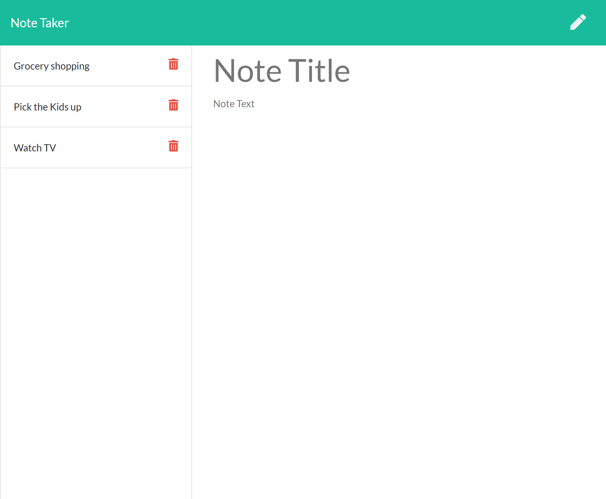

# Note Taker
  
## My story
* This project enabled me to better understand how back end communicates with the front end
* Server routes and paths make a lot more sense to me and why they are necessary
* The app can help users better organize their lives, and keep a list of to-do's throughout the day
* The toughest part of the assingment for me was understanding when a "WriteFile" or "ReadFile" was needed.
## Features ##
* I have code setup for future adjustments to this project that will enable a user to edit previously saved notes
* You can add or remove as many notes as you please and the page will automatically display your changes without having to refresh
* Future ideas what add a date with the notes if you need to keep track of things based upon time
## Installation ##
1. Open up git bash terminal
2. Change directory to desired location (%User Profile%/SourceRepo)
3. Clone the repository (git clone git@github.com:ChristianGoldman/Note-Taker.git)
## Usage ##
1. Open up git bash terminal
2. Change directory to the cloned repo
3. Navigate to the Note-Taker folder
4. In the command line run "npm install"
5. In the commmand line run "node server.js"
6. Navigate to the index.html file, right click on file and select open with default browser
7. click on "Get Started"
8. You can now add or remove as many notes as you wish
9. You should see a page similar to this

## Credits ##
* Cwerness gitlab
* http://expressjs.com/en/5x/api.html
* https://www.w3schools.com/js/default.asp
* Tutor Makism
* BCS learning assistants
* TA's Paul Hendrickson, Tommy Boone, Jake O'Thoole, Daniel Thao
## Link to Heroku App ##
* [Heroku App](https://www.youtube.com/watch?v=8XeiHgPI8a4&feature=youtu.be)
## License ##
    MIT License

    Copyright (c) [2020] [Christian Goldman]

    Permission is hereby granted, free of charge, to any person obtaining a copy
    of this software and associated documentation files (the "Software"), to deal
    in the Software without restriction, including without limitation the rights
    to use, copy, modify, merge, publish, distribute, sublicense, and/or sell
    copies of the Software, and to permit persons to whom the Software is
    furnished to do so, subject to the following conditions:

    The above copyright notice and this permission notice shall be included in all
    copies or substantial portions of the Software.

    THE SOFTWARE IS PROVIDED "AS IS", WITHOUT WARRANTY OF ANY KIND, EXPRESS OR
    IMPLIED, INCLUDING BUT NOT LIMITED TO THE WARRANTIES OF MERCHANTABILITY,
    FITNESS FOR A PARTICULAR PURPOSE AND NONINFRINGEMENT. IN NO EVENT SHALL THE
    AUTHORS OR COPYRIGHT HOLDERS BE LIABLE FOR ANY CLAIM, DAMAGES OR OTHER
    LIABILITY, WHETHER IN AN ACTION OF CONTRACT, TORT OR OTHERWISE, ARISING FROM,
    OUT OF OR IN CONNECTION WITH THE SOFTWARE OR THE USE OR OTHER DEALINGS IN THE
    SOFTWARE.